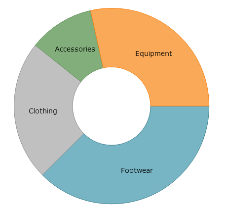

////
|metadata|
{
    "name": "xamdoughnutchart-adding",
    "controlName": ["{DoughnutChartName}"],
    "tags": ["Charting","Data Binding","Getting Started","How Do I"],
    "guid": "94d1edec-e7b1-4f61-b91e-d1827f82cccd",
    "buildFlags": ["SL","WPF","WINFORMS"],
    "createdOn": "2014-06-05T19:53:12.0218764Z"
}
|metadata|
////

= Adding {DoughnutChartName}

== Topic Overview

=== Purpose

This topic explains using a code example how to add the  _{DoughnutChartName}™_   control to a {PlatformName} application.

=== Required background

The following topic is a prerequisite to understanding this topic:

[options="header", cols="a,a"]
|====
|Topic|Purpose

| link:xamdoughnutchart-overview.html[{DoughnutChartName} Overview]
|This topic gives an overview of the _{DoughnutChartName}_ control and its main features.

|====

=== In this topic

This topic contains the following sections:

* <<_Ref348111468,Adding  _{DoughnutChartName}_  >>

** <<_Ref348111472,Introduction>>
** <<_Preview,Preview>>
** <<_Prerequisites,Prerequisites>>
** <<_Overview,Overview>>
** <<_Ref348111481,Steps>>

* <<_Ref348111483,Related Content>>

** <<_Ref348111487,Topics>>

ifdef::xaml[]
** <<_Ref348111490,Samples>>

endif::xaml[]

[[_Ref348111468]]
== Adding  _{DoughnutChartName}_

[[_Ref348111472]]

=== Introduction

The following procedure demonstrates how to add a  _{DoughnutChartName}_   to a {PlatformName} application.

[[_Preview]]

=== Preview

The following screenshot is a preview of the result.

ifdef::xaml[]
image::images/XamDoughnutChart_Adding_1.png[]
endif::xaml[]

ifdef::win-forms[]

endif::win-forms[]

[[_Prerequisites]]

=== Prerequisites

To complete the procedure, you need the following:

* A {PlatformName} application with references to the following assemblies:

** {ApiPlatform}{DoughnutChartAssembly}{ApiVersion}dll
** {ApiPlatform}DataVisualization{ApiVersion}dll

* A blank page with the Infragistics xml namespace declared: (`xmlns:ig="http://schemas.infragistics.com/xaml"`)

endif::xaml[]

ifdef::win-forms[]
** {ApiPlatform}DataVisualization{ApiVersion}.dll

** {ApiPlatform}{DoughnutChartAssembly}{ApiVersion}.dll

** Infragistics4.Portable.Core.dll

endif::win-forms[]

[[_Overview]]

=== Overview

Following is a conceptual overview of the process:

*1.*   *Adding sample data*

*2.*   *Adding the*   *_{DoughnutChartName}_*   *control*

*3. Adding the series*

[[_Ref348111481]]

=== Steps

The following steps demonstrate how to add the  _{DoughnutChartName}_   control to an application.

=== 1. Add sample data.

*1. Define the sample data model class*

In the code-behind of your page, add the following class declaration:

ifdef::xaml[]

*In C#:*

[source,csharp]
----
public class Category
{
    public string Label { get; set; }
    public double AveragePrice { get; set; }
}
----

endif::xaml[]

ifdef::win-forms[]

*In C#:*

[source,csharp]
----
public class Category
{
    public string Label { get; set; }
    public double AveragePrice { get; set; }
}
----

endif::win-forms[]

ifdef::xaml[]

*In Visual Basic:*

[source,vb]
----
Public Class Category
      Public Property Label As String
      Public Property AveragePrice As Double
End Class
----

endif::xaml[]

ifdef::win-forms[]

*In Visual Basic:*

[source,vb]
----
Public Class Category
      Public Property Label As String
      Public Property AveragePrice As Double
End Class
----

endif::win-forms[]

Create a list of instances of this class to serve as the pick:[xaml="`ItemsSource`"] pick:[win-forms="`DataSource`"] for the rendered RingSeries.

*2. Create a sample data list pick:[xaml="and set it as the page’s `DataContext`"].*

In the constructor of the page add the following code:

ifdef::xaml[]

*In C#:*

[source,csharp]
----
this.DataContext = new List<Category>()
{
    new Category () {Label="Footwear", AveragePrice=52.34},
    new Category () {Label="Clothing", AveragePrice=32.2},
    new Category () {Label="Accessories", AveragePrice=15.12},
    new Category () {Label="Equipment", AveragePrice=39.65}
};
----

endif::xaml[]

ifdef::win-forms[]

*In C#:*

[source,csharp]
----
this.DataContext = new List<Category>()
{
    new Category () {Label="Footwear", AveragePrice=52.34},
    new Category () {Label="Clothing", AveragePrice=32.2},
    new Category () {Label="Accessories", AveragePrice=15.12},
    new Category () {Label="Equipment", AveragePrice=39.65}
};
----

endif::win-forms[]

ifdef::xaml[]

*In Visual Basic:*

[source,vb]
----
Me.DataContext = New List(Of Category)() From { _
      New Category() With {      .Label = "Footwear", .AveragePrice = 52.34      }, _
      New Category() With {      .Label = "Clothing", .AveragePrice = 32.2 }, _
      New Category() With {      .Label = "Accessories", .AveragePrice = 15.12 }, _
      New Category() With {      .Label = "Equipment",      .AveragePrice = 39.65      } _
}
----

endif::xaml[]

ifdef::win-forms[]

*In Visual Basic:*

[source,vb]
----
Me.DataContext = New List(Of Category)() From { _
      New Category() With {      .Label = "Footwear", .AveragePrice = 52.34      }, _
      New Category() With {      .Label = "Clothing", .AveragePrice = 32.2 }, _
      New Category() With {      .Label = "Accessories", .AveragePrice = 15.12 }, _
      New Category() With {      .Label = "Equipment",      .AveragePrice = 39.65      } _
}
----

endif::win-forms[]

=== 2. Add the {DoughnutChartName} control.

Add a  _{DoughnutChartName}_   declaration  pick:[xaml="to your page’s root Grid element"] :

ifdef::xaml[]

*In XAML:*

ifdef::xaml[]
----
<ig:{DoughnutChartName} x:Name="doughnutChart">
</ig:{DoughnutChartName}>
----
endif::xaml[]

endif::xaml[]

ifdef::win-forms[]

pick:[win-forms="*In C#:*"]

----
UltraDoughnutChart dc = new UltraDoughnutChart();
----

pick:[win-forms="*In VB:*"]

----
Dim dc As New UltraDoughnutChart()
----
endif::win-forms[]

=== 3. Add the series.

*1. Add the series.*

In order to display data in a  _{DoughnutChartName}_  , you need to add one or more series to its link:{DoughnutChartLink}.{DoughnutChartName}{ApiProp}series.html[Series] collection. This procedure uses one link:{DoughnutChartLink}.ringseries_members.html[RingSeries].

*2. Set the required properties to the series.*

In order to configure the series correctly, you need to set the  pick:[android,xaml=" link:{DoughnutChartLink}.ringseriesbase{ApiProp}itemssource.html[ItemsSource]"]  pick:[win-forms=" link:{DoughnutChartLink}.ringseriesbase{ApiProp}datasource.html[DataSource]"] , link:{DoughnutChartLink}.ringseriesbase{ApiProp}valuememberpath.html[ValueMemberPath] and optionally the link:{DoughnutChartLink}.ringseriesbase{ApiProp}labelmemberpath.html[LabelMemberPath] and link:{DoughnutChartLink}.ringseriesbase{ApiProp}labelsposition.html[LabelsPosition] properties in accordance with the following steps.

A. Set the pick:[xaml="`ItemsSource`"]pick:[win-forms="`DataSource`"]

The pick:[xaml="`ItemsSource`"]pick:[win-forms="`DataSource`"] is an `IEnumerable` property that is where the data for the series comes from.  pick:[xaml="In this example bind this property directly to the `DataContext`."]

[start=2]
B. Set the `ValueMemberPath`

You must set the `ValueMemberPath` to the name of a property used to calculate the size of its respective slice. In the case of this example set the property to `“AveragePrice”`.

[start=3]
C. Set the `LabelMemberPath`

You must set the `LabelMemberPath` to the name of a property in your data objects used to get the labels for each slice of the chart. In the case of this example set the property to `“Label”`.

[start=4]
D. Set the `LabelsPosition`  _(optional)_

The `LabelsPosition` specifies labels positions relative to their slice. In the case of this example set it to `BestFit`.

ifdef::xaml[]

*In XAML:*

ifdef::xaml[]
----
<ig:{DoughnutChartName} x:Name="doughnutChart">
    <ig:{DoughnutChartName}.Series>
        <ig:RingSeries ItemsSource="{Binding}" LabelMemberPath="Label" ValueMemberPath="AveragePrice" LabelsPosition="BestFit"/>
    </ig:{DoughnutChartName}.Series>
</ig:{DoughnutChartName}>
----
endif::xaml[]

endif::xaml[]

ifdef::win-forms[]

pick:[win-forms="*In C#:*"]

----
RingSeries ringSeries = new RingSeries 
{ 
  DataSource = list, 
  LabelMemberPath = "Label",
  ValueMemberPath = "AveragePrice"
};
----

pick:[win-forms="*In VB:*"]

----
Dim ringSeries As New RingSeries 
{ 
 .DataSource = list, _
  .LabelMemberPath = "Label", _
  .ValueMemberPath = "AveragePrice" _
}
----
endif::win-forms[]

[[_Ref348111483]]
== Related Content

[[_Ref348111487]]

=== Topics

The following topic provides additional information related to this topic.

[options="header", cols="a,a"]
|====
|Topic|Purpose

| link:xamdoughnutchart-configuring-selection-and-explosion.html[Configuring Selection and Explosion ({DoughnutChartName})]
|This topic explains how to configure selection and explosion for the slices of the _{DoughnutChartName}_ .

|====

[[_Ref348111490]]
ifdef::sl,wpf[]
=== Samples

The following samples provide additional information related to this topic.

[options="header", cols="a,a"]
|====
|Sample|Purpose

|

link:{SamplesURL}/doughnut-chart/doughnut-chart[Doughnut Chart] 

|This sample demonstrates a basic configuration for _{DoughnutChartName}_ and some of its main properties.

|

link:{SamplesURL}/doughnut-chart/multiple-rings[Multiple Rings] 

|This sample demonstrates how to display multiple ring series in a _{DoughnutChartName}_ .

|====
endif::sl,wpf[]