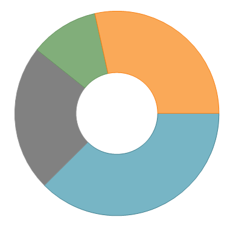

////
|metadata|
{
    "name": "xamdoughnutchart-configuring-selection-and-explosion",
    "controlName": ["{DoughnutChartName}"],
    "tags": ["API","Charting","How Do I","Selection"],
    "guid": "bd1caca1-194c-4c95-bb73-cd1b18034d9e",
    "buildFlags": ["SL","WPF","WINFORMS"],
    "createdOn": "2014-06-05T19:53:12.0238775Z"
}
|metadata|
////

= Configuring Selection and Explosion ({DoughnutChartName})

== Topic Overview

=== Purpose

This topic explains how to configure selection and explosion for the slices of the  _{DoughnutChartName}™_ .

=== Required background

The following topics are prerequisites to understanding this topic:

[options="header", cols="a,a"]
|====
|Topic|Purpose

| link:xamdoughnutchart-overview.html[{DoughnutChartName} Overview]
|This topic gives an overview of the _{DoughnutChartName}™_ control and its main features.

| link:xamdoughnutchart-adding.html[Adding {DoughnutChartName}]
|This topic explains using a code example how to add the _{DoughnutChartName}_ control to a {PlatformName} application.

|====

=== In this topic

This topic contains the following sections:

* <<_Ref349921536, Slice Selection Configuration Summary >>
* <<_Ref349921540, Enable/ Disable Slice Selection >>

** <<_Ref349921543,Overview>>
** <<_Ref349921549,Property settings>>

* <<_Ref349921551, Configuring the Look of the Selected Slices >>

** <<_Ref349921554,Overview>>
** <<_Ref349921556,Property settings>>
** <<_Ref349921558,Example>>

* <<_Ref349921563, Changing the Selection State upon Slice Click >>

** <<_Ref349921566,Overview>>
** <<_Ref349921568,Property settings>>
** <<_Ref349921569,Example>>

ifdef::xaml,android[]
* <<_Ref349921572, pick:[xaml,android=" *Setting the IsSelected Property* "] >>

** <<_Ref349921757,Overview>>
** <<_Ref349921758,Property settings>>
** <<_Ref349921761, pick:[xaml,android="Exampl"] e>>

endif::xaml,android[]

ifdef::xaml,android[]
* <<_Ref349921763, Modifying the Contents of the SelectedSlices Collection >>

** <<_Ref349921798,Overview>>
** <<_Ref349921800,Property settings>>
** <<_Ref349921802,Example>>

endif::xaml,android[]

* <<_Ref349921812, Slice Explosion Configuration Summary >>
* <<_Ref349921821, Enable/ Disable Slice Explosion >>

** <<_Ref349921825,Overview>>
** <<_Ref349921827,Property settings>>
** <<_Ref349921834,Example>>

* <<_Ref349921837, Changing the Explosion State upon Slice Click >>

** <<_Ref349921838,Overview>>
** <<_Ref349921843,Property settings>>
** <<_Ref349921845,Example>>

ifdef::android,xaml[]
* <<_Ref349921847, pick:[android,xaml=" *Setting the IsExploded Property* "] >>

** <<_Ref349921851,Overview>>
** <<_Ref349921853,Property settings>>
** <<_Ref349921857,Example>>

endif::android,xaml[]

ifdef::xaml,android[]
* <<_Ref349921859, Modifying the Contents of the ExplodedSlices Collection >>

** <<_Ref349921861,Overview>>
** <<_Ref349921864,Property settings>>
** <<_Ref349921866,Example>>

endif::xaml,android[]

[[_Ref349921536]]
== Slice Selection Configuration Summary

=== Control configuration summary chart

The following table lists the configurable aspects of the  _{DoughnutChartName}_   control related to slice selection.

[options="header", cols="a,a,a"]
|====
|Configurable aspect|Details|Properties / Events

|Enable/disable slice selection
|You can enable or disable the ability to select slices or not.
|
* link:{DoughnutChartLink}.{DoughnutChartName}{ApiProp}allowsliceselection.html[AllowSliceSelection] 

|Configuring the look of the selected slices
|You can define how the selected slices will look by defining a style pick:[xaml,android="with a `TargetType` of"] pick:[xaml,android=" link:{DoughnutChartLink}.slice_members.html[Slice]"] and assigning it to the link:{DoughnutChartLink}.{DoughnutChartName}{ApiProp}selectedstyle.html[SelectedStyle] property of the pick:[android,xaml=" _{DoughnutChartName}_ "] pick:[win-forms="RingSeries"] .
|
* link:{DoughnutChartLink}.{DoughnutChartName}{ApiProp}selectedstyle.html[SelectedStyle] 

|Changing the selection state upon slice click
|If you attach an event handler for the link:{DoughnutChartLink}.{DoughnutChartName}{ApiProp}sliceclick_ev.html[SliceClick] event, it supplies a reference to the clicked slice in the event arguments allowing you to modify its selection state.
|
* link:{DoughnutChartLink}.{DoughnutChartName}{ApiProp}sliceclick_ev.html[SliceClick] 

|Setting the IsSelected property
|The _{DoughnutChartName}_ holds references to all the slices allowing you to modify their IsSelected property directly.
|
* link:{DoughnutChartLink}.slice{ApiProp}isselected.html[Slice.IsSelected] 

|Modifying the contents of the SelectedSlices collection
|You can change the selected slice by changing the contents of the SelectedSlices collection.
|
* pick:[xaml,android=" link:{DoughnutChartLink}.{DoughnutChartName}{ApiProp}selectedslices.html[SelectedSlices]"] pick:[win-forms=" link:{DoughnutChartLink}.ringseries{ApiProp}selectedslices.html[SelectedSlices]"] 

|====

[[_Ref349921540]]
== Enable/ Disable Slice Selection

[[_Ref349921543]]

=== Overview

You can enable (default setting) or disable slice selection in the  _{DoughnutChartName}_  .

.Note:
[NOTE]
====
You must perform all the remaining slice selection configurations in this topic with slice selection enabled.
====

[[_Ref349921549]]

=== Property settings

The following table maps the desired behavior to property settings.

[options="header", cols="a,a,a"]
|====
|In order to:|Use this property:|And set it to:

|Enable/Disable slice selection
| link:{DoughnutChartLink}.{DoughnutChartName}{ApiProp}allowsliceselection.html[AllowSliceSelection]
|`True` or `False`

|====

[[_Ref349921551]]
== Configuring the Look of the Selected Slices

[[_Ref349921554]]

=== Overview

The  _{DoughnutChartName}_   exposes a link:{DoughnutChartLink}.{DoughnutChartName}{ApiProp}selectedstyle.html[SelectedStyle] property that determines the look of the selected slices. By default, no style is applied, and selecting a slice will not alter its appearance in any way. In order to apply your own style to the selected slices you need to define a `Style`  pick:[xaml,android="with `TargetType` of"]   pick:[xaml,android=" link:{DoughnutChartLink}.slice_members.html[Slice]"]  and set it as the value of the link:{DoughnutChartLink}.{DoughnutChartName}{ApiProp}selectedstyle.html[SelectedStyle] property.

[[_Ref349921556]]

=== Property settings

The following table maps the desired behavior to property settings.

[options="header", cols="a,a,a"]
|====
|In order to:|Use this property:|And set it to:

|Configure the look for selected slices.
| link:{DoughnutChartLink}.{DoughnutChartName}{ApiProp}selectedstyle.html[SelectedStyle]
|pick:[android,xaml="A `Style` with `TargetType` of"] pick:[android,xaml=" link:{DoughnutChartLink}.slice_members.html[Slice]"] pick:[win-forms=" link:{DoughnutChartLink}.ringseries_members.html[RingSeries]"]

|====

[[_Ref349921558]]

=== Example

The screenshot below demonstrates how the selected slice (the slice at the top) of the  _{DoughnutChartName}_   looks as a result of the following settings:

[options="header", cols="a,a"]
|====
|Property|Value

| link:{DoughnutChartLink}.{DoughnutChartName}{ApiProp}selectedstyle.html[SelectedStyle]
|
ifdef::xaml[] 

*In XAML:*

---- 
<ig:{DoughnutChartName}>
  <ig:{DoughnutChartName}.SelectedStyle>
    
  </ig:{DoughnutChartName}.SelectedStyle>
...
---- 

endif::xaml[] 

ifdef::win-forms[] 

*In C#:*

---- 
StylesliceStyle = new Style   
{ 
Fill = Color.Gray, 
Opacity = .75, 
}; 
ringSeries.SelectedStyle = sliceStyle; 
---- 

*In VB:*

---- 
Dim sliceStyle As New Style 
{ 
.Fill = Color.Gray, _ 
.Opacity = .75, _ 
} 
ringSeries.SelectedStyle = sliceStyle; 
---- 
endif::win-forms[] 

|====

ifdef::xaml[]
image::images/XamDoughnutChart_Selection_Explosion_1.png[]
endif::xaml[]

ifdef::win-forms[]

endif::win-forms[]

[[_Ref349921563]]
== Changing the Selection State upon Slice Click

[[_Ref349921566]]

=== Overview

The  _{DoughnutChartName}_   exposes a link:{DoughnutChartLink}.{DoughnutChartName}{ApiProp}sliceclick_ev.html[SliceClick] event used to change the selected/unselected state of a slice.

[[_Ref349921568]]

=== Property settings

The following table maps the desired behavior to property settings.

[options="header", cols="a,a,a"]
|====
|In order to:|Use this event / property:|What to do:

|Set the `IsSelected` property
| link:{DoughnutChartLink}.{DoughnutChartName}{ApiProp}sliceclick_ev.html[SliceClick] 

SliceClickEventArgs.IsSelected
|Set the pick:[xaml,android=" link:{DoughnutChartLink}.slice{ApiProp}isselected.html[IsSelected]"] pick:[win-forms=" link:{DoughnutChartLink}.doughnutsliceclickeventargs{ApiProp}isselected.html[IsSelected]"] property of the SliceClickEventArgs to `True` or `False`

|====

[[_Ref349921569]]

=== Example

The following code example demonstrates how to toggle the selection state of slices upon click.

ifdef::xaml[]

*In XAML:*

ifdef::xaml[]
----
<ig:{DoughnutChartName} SliceClick="DoughnutSliceClicked">
…
----
endif::xaml[]

endif::xaml[]

ifdef::xaml[]

*In C#:*

ifdef::xaml[]
----
private void DoughnutSliceClicked(object sender, SliceClickEventArgs e)
{
    e.IsSelected = !e.IsSelected;
}
----
endif::xaml[]

endif::xaml[]

ifdef::xaml[]

*In Visual Basic:*

ifdef::xaml[]
----
Private Sub DoughnutSliceClicked(sender As Object, e As SliceClickEventArgs)
      e.IsSelected = Not e.IsSelected
End Sub
----
endif::xaml[]

endif::xaml[]

ifdef::win-forms[]

pick:[win-forms="*In C#:*"]

ifdef::win-forms[]
----
void DoughnutChart_SliceClick(object sender, DoughnutSliceClickEventArgs e) 
{ 
 e.IsSelected = !e.IsSelected; 
}
----
endif::win-forms[]

endif::win-forms[]

ifdef::win-forms[]

pick:[win-forms="*In VB:*"]

ifdef::win-forms[]
----
Private Sub DoughnutChart_SliceClick(sender As Object, e As DoughnutSliceClickEventArgs)
  e.IsSelected = Not e.IsSelected
End Sub
----
endif::win-forms[]

endif::win-forms[]

[[_Ref349921572]]

ifdef::xaml,android[]
== Setting the IsSelected Property
endif::xaml,android[]

[[_Ref349921757]]

=== Overview

The  _{DoughnutChartName}_   holds references to all the slices allowing you to modify their link:{DoughnutChartLink}.slice{ApiProp}isselected.html[IsSelected] property directly to the link:{DoughnutChartLink}.slice_members.html[Slice] objects.

ifdef::xaml,android[]

[[_Ref349921758]]

=== Property settings

The following table maps the desired behavior to property settings.

[options="header", cols="a,a,a"]
|====
|In order to:|Use this event / property:|What to do:

|Change the selection state upon slice click
| link:{DoughnutChartLink}.slice{ApiProp}isselected.html[Slice.IsSelected]
|Set the link:{DoughnutChartLink}.slice{ApiProp}isselected.html[IsSelected] property of the link:{DoughnutChartLink}.slice_members.html[Slice] to `True` or `False`

|====

endif::xaml,android[]

ifdef::xaml,android[]

[[_Ref349921761]]

=== Example

The following code example demonstrates how to obtain a reference to the first slice of the  _{DoughnutChartName}_   in order to set its link:{DoughnutChartLink}.slice{ApiProp}isselected.html[IsSelected] property. Note that the execution of this code must occur after loading the particular ring series.

*In XAML:*

ifdef::hs-build-flags:[]
----
<ig:{DoughnutChartName} x:Name="doughnutChart">
    <ig:RingSeries Loaded="SeriesLoaded">
…
----
endif::hs-build-flags:[]

*In C#:*

ifdef::xaml[]
----
private void SeriesLoaded(object sender,  RoutedEventArgs    e)
{
    var firstSlice = ((RingSeries)this.doughnutChart.Series[0]).Ring.ArcItems[0].SliceItems[0].Slice;
    firstSlice.IsSelected = true;
}
----
endif::xaml[]

ifdef::win-forms[]
----
private void SeriesLoaded(object sender,    SeriesLoadedEventArgs  e)
{
    var firstSlice = ((RingSeries)this.doughnutChart.Series[0]).Ring.ArcItems[0].SliceItems[0].Slice;
    firstSlice.IsSelected = true;
}
----
endif::win-forms[]

*In Visual Basic:*

ifdef::xaml[]
----
Private Sub SeriesLoaded(sender As Object, e As  RoutedEventArgs   )
      Dim firstSlice = DirectCast(Me.doughnutChart.Series(0), RingSeries).Ring.ArcItems(0).SliceItems(0).Slice
      firstSlice.IsSelected = True
End Sub
----
endif::xaml[]

ifdef::win-forms[]
----
Private Sub SeriesLoaded(sender As Object, e As    SeriesLoadedEventArgs )
      Dim firstSlice = DirectCast(Me.doughnutChart.Series(0), RingSeries).Ring.ArcItems(0).SliceItems(0).Slice
      firstSlice.IsSelected = True
End Sub
----
endif::win-forms[]

endif::xaml,android[]

ifdef::xaml,android[]

[[_Ref349921763]]
== Modifying the Contents of the SelectedSlices Collection

endif::xaml,android[]

ifdef::xaml,android[]

[[_Ref349921798]]

=== Overview

ifdef::xaml,android[]

Another approach for managing the selected slices is to modify the contents of the  pick:[xaml,android=" link:{DoughnutChartLink}.{DoughnutChartName}{ApiProp}selectedslices.html[SelectedSlices]"]  pick:[win-forms=" link:{DoughnutChartLink}.ringseries{ApiProp}selectedslices.html[SelectedSlices]"]  collection of the  _{DoughnutChartName}_  . To do this, you need to obtain a reference to one or more  pick:[android,xaml=" link:{DoughnutChartLink}.slice_members.html[Slice]"]  pick:[win-forms="slice"]  objects that you want to select and add them to the SelectedSlices. If you want to unselect slices, remove them from the collection.
endif::xaml,android[]

endif::xaml,android[]

ifdef::xaml,android[]

[[_Ref349921800]]

=== Property settings

ifdef::xaml,android[]

The following table maps the desired behaviors to property settings.

[options="header", cols="a,a,a"]
|====
|In order to:|Use this event / property:|What to do:

|Modify the contents of the SelectedSlices collection
|pick:[xaml,android=" link:{DoughnutChartLink}.{DoughnutChartName}{ApiProp}selectedslices.html[SelectedSlices]"] pick:[win-forms=" link:{DoughnutChartLink}.ringseries{ApiProp}selectedslices.html[SelectedSlices]"]
|Add or Remove the respective pick:[xaml,android=" link:{DoughnutChartLink}.sliceitem_members.html[SliceItem]"] pick:[win-forms="slice"] from the SelectedSlices collection.

|====

endif::xaml,android[]

endif::xaml,android[]

ifdef::xaml,android[]

[[_Ref349921802]]

=== Example

ifdef::xaml,android[]

The following code example demonstrates how to obtain a reference to the first slice of the  _{DoughnutChartName}_   in and add it to the collection with selected slices. An example of removing an item is also available. Note, execution of this code must occur after loading the particular ring series.

ifdef::xaml[]

*In XAML:*

ifdef::xaml[]
----
<ig:{DoughnutChartName} x:Name="doughnutChart">
    <ig:RingSeries Loaded="SeriesLoaded">
…
----
endif::xaml[]

endif::xaml[]

ifdef::xaml,win-forms[]

*In C#:*

ifdef::xaml[]
----
private void SeriesLoaded(object sender,  RoutedEventArgs    e)
{
     var firstSlice = ((RingSeries)this.doughnutChart.Series[0]).Ring.ArcItems[0].SliceItems[0].Slice;     {}; "] 
 // To add a selected item:
this.doughnutChart.SelectedSlices.Add(3);   
    // To remove a selected item: 
     this.doughnutChart.SelectedSlices.RemoveAt(3);   
}
----
endif::xaml[]

ifdef::win-forms[]
----
private void SeriesLoaded(object sender,    SeriesLoadedEventArgs  e)
{
       RingSeries   ringSeries1 = new  pick:[win-forms="RingSeries {}; "] 
 // To add a selected item:
  ringSeries1.SelectedSlices.Add(3); 
    // To remove a selected item: 
       ringSeries.SelectedSlices.Remove(3); 
}
----
endif::win-forms[]

ifdef::android[]
----
private void SeriesLoaded(object sender,      e)
{
     var firstSlice = ((RingSeries)this.doughnutChart.Series[0]).Ring.ArcItems[0].SliceItems[0].Slice;     {}; "] 
 // To add a selected item:
this.doughnutChart.SelectedSlices.Add(3);   
    // To remove a selected item: 
     this.doughnutChart.SelectedSlices.RemoveAt(3);   
}
----
endif::android[]

endif::xaml,win-forms[]

ifdef::xaml,win-forms[]

*In Visual Basic:*

ifdef::xaml[]
----
Private Sub SeriesLoaded(sender As Object, e As  RoutedEventArgs   )
       Dim firstSlice = DirectCast(Me.doughnutChart.Series(0), RingSeries).Ring.ArcItems(0).SliceItems(0).Slice   
 ' To add a selected item:
Me.doughnutChart.SelectedSlices.Add(firstSlice)   
 ' To remove a selected item: 
       Me.doughnutChart.SelectedSlices.RemoveAt(0)   
End Sub
----
endif::xaml[]

ifdef::win-forms[]
----
Private Sub SeriesLoaded(sender As Object, e As    SeriesLoadedEventArgs )
         Dim ringSeries1 = As New RingSeries{} 
 ' To add a selected item:
  ringSeries1.SelectedSlices.Add(3); 
 ' To remove a selected item: 
         ringSeries.SelectedSlices.Remove(3); 
End Sub
----
endif::win-forms[]

ifdef::android[]
----
Private Sub SeriesLoaded(sender As Object, e As     )
       Dim firstSlice = DirectCast(Me.doughnutChart.Series(0), RingSeries).Ring.ArcItems(0).SliceItems(0).Slice   
 ' To add a selected item:
Me.doughnutChart.SelectedSlices.Add(firstSlice)   
 ' To remove a selected item: 
       Me.doughnutChart.SelectedSlices.RemoveAt(0)   
End Sub
----
endif::android[]

endif::xaml,win-forms[]

endif::xaml,android[]

endif::xaml,android[]

[[_Ref349921812]]
== Slice Explosion Configuration Summary

=== Control configuration summary chart

The following table lists the configurable aspects of the  _{DoughnutChartName}_   control related to slice explosion.

[options="header", cols="a,a,a"]
|====
|Configurable aspect|Details|Properties / Events

|Enable/disable slice explosion
|You can enable or disable the ability to explode slices.
|
link:{DoughnutChartLink}.piechartbase{ApiProp}allowsliceexplosion.html[AllowSliceExplosion] 

|Changing the exploded state of a slice upon slice click
|If you attach an event handler for the link:{DoughnutChartLink}.{DoughnutChartName}{ApiProp}sliceclick_ev.html[SliceClick] event, a reference to the clicked slice is supplied in the event arguments and you can modify its exploded state.
|
link:{DoughnutChartLink}.{DoughnutChartName}{ApiProp}sliceclick_ev.html[SliceClick] 

|Setting the link:{DoughnutChartLink}.slice{ApiProp}isexploded.html[IsExploded] property
|The _{DoughnutChartName}_ holds references to all the slices allowing you to modify their link:{DoughnutChartLink}.slice{ApiProp}isexploded.html[IsExploded] property directly.
|
link:{DoughnutChartLink}.slice{ApiProp}isexploded.html[Slice.IsExploded] 

|Modifying the contents of the ExplodedSlices collection
|You can change the exploded slices by changing the contents of the ExplodedSlices collection.
|
pick:[android,xaml=" link:{DoughnutChartLink}.{DoughnutChartName}{ApiProp}explodedslices.html[ExplodedSlices]"] pick:[win-forms=" link:{DoughnutChartLink}.piechartbase{ApiProp}explodedslices.html[ExplodedSlices]"] 

|====

[[_Ref349921821]]
== Enable/ Disable Slice Explosion

[[_Ref349921825]]

=== Overview

You can enable (default setting) or disable slice explosion in the  _{DoughnutChartName}_  .

.Note:
[NOTE]
====
You must perform all the remaining slice explosion configurations in this topic with slice explosion enabled.
====

[[_Ref349921827]]

=== Property settings

The following table maps the desired behavior to property settings.

[options="header", cols="a,a,a"]
|====
|In order to:|Use this property:|And set it to:

|Enable/Disable slice explosion
| link:{DoughnutChartLink}.piechartbase{ApiProp}allowsliceexplosion.html[AllowSliceExplosion]
|`True` or `False`

|====

[[_Ref349921834]]

=== Example

The following screenshot demonstrates a  _{DoughnutChartName}_   with 1 slice exploded.

ifdef::android,xaml,win-forms[]
image::images/XamDoughnutChart_Selection_Explosion_2.png[]
endif::android,xaml,win-forms[]

ifdef::win-forms[]
image::images/Doughnut_NoLabels.png[]
endif::win-forms[]

[[_Ref349921837]]
== Changing the Explosion State upon Slice Click

[[_Ref349921838]]

=== Overview

The  _{DoughnutChartName}_   exposes a link:{DoughnutChartLink}.{DoughnutChartName}{ApiProp}sliceclick_ev.html[SliceClick] event used to change whether a slice is exploded.

[[_Ref349921843]]

=== Property settings

The following table maps the desired behavior to property settings.

[options="header", cols="a,a,a"]
|====
|In order to:|Use this event / property:|What to do:

|Set the IsExploded property
| link:{DoughnutChartLink}.{DoughnutChartName}{ApiProp}sliceclick_ev.html[SliceClick] 

SliceClickEventArgs.IsExploded
|Set the pick:[xaml,android=" link:{DoughnutChartLink}.slice{ApiProp}isexploded.html[IsExploded]"] pick:[win-forms=" link:{DoughnutChartLink}.doughnutsliceclickeventargs{ApiProp}isexploded.html[IsExploded]"] property of the SliceClickEventArgs to `True` or `False`

|====

[[_Ref349921845]]

=== Example

The following code example demonstrates how to toggle the explosion state of slices upon click.

ifdef::xaml[]

*In XAML:*

ifdef::xaml[]
----
<ig:{DoughnutChartName} SliceClick="DoughnutSliceClicked">
…
----
endif::xaml[]

endif::xaml[]

ifdef::xaml,win-forms[]

*In C#:*

ifdef::xaml[]
----
private void DoughnutSliceClicked(object sender,  RoutedEventArgs e)
{
    e.IsExploded = !e.IsExploded;
}
----
endif::xaml[]

ifdef::win-forms[]
----
private void DoughnutSliceClicked(object sender, DoughnutSliceClickedEventArgs e)
{
    e.IsExploded = !e.IsExploded;
}
----
endif::win-forms[]

endif::xaml,win-forms[]

ifdef::xaml,win-forms[]

*In Visual Basic:*

ifdef::xaml[]
----
Private Sub DoughnutSliceClicked(sender As Object, e As RoutedEventArgs)
      e.IsExploded = Not e.IsExploded
End Sub
----
endif::xaml[]

ifdef::win-forms[]
----
Private Sub DoughnutSliceClicked(sender As Object, e As DoughnutSliceClickedEventArgs)
      e.IsExploded = Not e.IsExploded
End Sub
----
endif::win-forms[]

endif::xaml,win-forms[]

[[_Ref349921847]]

ifdef::xaml,android[]
== Setting the IsExploded Property
endif::xaml,android[]

ifdef::xaml,android[]

[[_Ref349921851]]

=== Overview

The  _{DoughnutChartName}_   exposes a link:{DoughnutChartLink}.{DoughnutChartName}{ApiProp}sliceclick_ev.html[SliceClick] event used to change whether a slice is exploded.

endif::xaml,android[]

ifdef::xaml,android[]

[[_Ref349921853]]

=== Property settings

The following table maps the desired behavior to property settings.

[options="header", cols="a,a,a"]
|====
|In order to:|Use this event / property:|What to do:

|Change the explosion state upon slice click
| link:{DoughnutChartLink}.slice{ApiProp}isexploded.html[Slice.IsExploded]
|Set the link:{DoughnutChartLink}.slice{ApiProp}isexploded.html[IsExploded] property of the link:{DoughnutChartLink}.slice_members.html[Slice] to `True` or `False`

|====

endif::xaml,android[]

ifdef::xaml,android[]

[[_Ref349921857]]

=== Example

The following code example demonstrates how to obtain a reference to the first slice of the  _{DoughnutChartName}_   in order to set its link:{DoughnutChartLink}.slice{ApiProp}isexploded.html[IsExploded] property. Note that execution of this code must occur after loading the particular ring series.

ifdef::xaml[]

*In XAML:*

ifdef::xaml[]
----
<ig:{DoughnutChartName} x:Name="doughnutChart">
    <ig:RingSeries Loaded="SeriesLoaded">
        …
    </ig:RingSeries>
    …
</ig:{DoughnutChartName}>
----
endif::xaml[]

endif::xaml[]

ifdef::xaml[]

*In C#:*

ifdef::xaml[]
----
private void SeriesLoaded(object sender, RoutedEventArgs e)
{
    var firstSlice = ((RingSeries)this.doughnutChart.Series[0]).Ring.ArcItems[0].SliceItems[0].Slice;
    firstSlice.IsExploded = true;
}
----
endif::xaml[]

endif::xaml[]

ifdef::xaml[]

*In Visual Basic:*

ifdef::xaml[]
----
Private Sub SeriesLoaded(sender As Object, e As RoutedEventArgs)
      Dim firstSlice = DirectCast(Me.doughnutChart.Series(0), RingSeries).Ring.ArcItems(0).SliceItems(0).Slice
      firstSlice.IsExploded = True
End Sub
----
endif::xaml[]

endif::xaml[]

endif::xaml,android[]

ifdef::xaml,android[]

[[_Ref349921859]]
== Modifying the Contents of the ExplodedSlices Collection

endif::xaml,android[]

ifdef::xaml,android[]

[[_Ref349921861]]

=== Overview

ifdef::xaml,android[]

Another approach for managing the exploded slices is to modify the contents of the  pick:[android,xaml=" link:{DoughnutChartLink}.{DoughnutChartName}{ApiProp}explodedslices.html[ExplodedSlices]"]  pick:[win-forms=" link:{DoughnutChartLink}.piechartbase{ApiProp}explodedslices.html[ExplodedSlices]"]  collection of the  _{DoughnutChartName}_  . To do this, you need to obtain a reference to one or more  pick:[android,xaml=" link:{DoughnutChartLink}.slice_members.html[Slice]"]  pick:[win-forms="slice"]  objects that you want to be able to explode and add them to the link:{DoughnutChartLink}.piechartbase{ApiProp}explodedslices.html[ExplodedSlices]. If you want to set the non-exploded state of slices, remove them from the collection.
endif::xaml,android[]

endif::xaml,android[]

ifdef::xaml,android[]

[[_Ref349921864]]

=== Property settings

The following table maps the desired behavior to property settings.

[options="header", cols="a,a,a"]
|====
|In order to:|Use this event / property:|What to do:

|Modify the contents of the ExplodedSlices collection
|pick:[android,xaml=" link:{DoughnutChartLink}.{DoughnutChartName}{ApiProp}explodedslices.html[ExplodedSlices]"] pick:[win-forms=" link:{DoughnutChartLink}.piechartbase{ApiProp}explodedslices.html[ExplodedSlices]"]
|Add or Remove the respective pick:[android,xaml=" link:{DoughnutChartLink}.sliceitem_members.html[SliceItem]"] pick:[win-forms="slice"] from the ExplodedSlices collection.

|====

endif::xaml,android[]

ifdef::xaml,android[]

[[_Ref349921866]]

=== Example

The following code example demonstrates how to obtain a reference to the first slice of the  _{DoughnutChartName}_   in and add it to the collection with exploded slices. An example for removing an item is also available. Note, execution of this code must occur after loading the particular ring series.

ifdef::xaml[]

*In XAML:*

ifdef::xaml[]
----
<ig:{DoughnutChartName} x:Name="doughnutChart">
    <ig:RingSeries Loaded="SeriesLoaded">
        …
    </ig:RingSeries>
    …
</ig:{DoughnutChartName}>
----
endif::xaml[]

endif::xaml[]

ifdef::xaml,win-forms[]

*In C#:*

ifdef::xaml[]
----
private void SeriesLoaded(object sender, RoutedEventArgs e)
{
    var firstSlice = ((RingSeries)this.doughnutChart.Series[0]).Ring.ArcItems[0].SliceItems[0].Slice; 
    // To add an exploded item:
    this.doughnutChart.ExplodedSlices.Add(firstSlice);   
    // To remove an exploded item: 
    this.doughnutChart.ExplodedSlices.RemoveAt(0);   
}
----
endif::xaml[]

ifdef::win-forms[]
----
private void SeriesLoaded(object sender,    SeriesLoadedEventArgs  e)
{
       RingSeries   ringSeries1 = new  pick:[win-forms="RingSeries {}; "] 
 // To add an exploded item:
  ringSeries1.ExplodedSlices.Add(3); 
    // To remove an exploded item: 
       ringSeries.ExplodedSlices.Remove(3); 
}
----
endif::win-forms[]

ifdef::android[]
----
private void SeriesLoaded(object sender,      e)
{
     var firstSlice = ((RingSeries)this.doughnutChart.Series[0]).Ring.ArcItems[0].SliceItems[0].Slice;     {}; "] 
 // To add an exploded item:
this.doughnutChart.ExplodedSlices.Add(3);   
    // To remove an exploded item: 
     this.doughnutChart.ExplodedSlices.RemoveAt(3);   
}
----
endif::android[]

endif::xaml,win-forms[]

ifdef::xaml,win-forms[]

*In Visual Basic:*

ifdef::xaml[]
----
Private Sub SeriesLoaded(sender As Object, e As  RoutedEventArgs   )
    Dim firstSlice = DirectCast(Me.doughnutChart.Series(0), RingSeries).Ring.ArcItems(0).SliceItems(0).Slice   
    ' To add an exploded item:
    Me.doughnutChart.ExplodedSlices.Add(firstSlice)   
    ' To remove an exploded item: 
    Me.doughnutChart.ExplodedSlices.RemoveAt(0)   
End Sub
----
endif::xaml[]

ifdef::win-forms[]
----
Private Sub SeriesLoaded(sender As Object, e As    SeriesLoadedEventArgs )
         Dim ringSeries1 = As New RingSeries{} 
 ' To add an exploded item:
  ringSeries1.ExplodedSlices.Add(3); 
 ' To remove an exploded item: 
         ringSeries.ExplodedSlices.Remove(3); 
End Sub
----
endif::win-forms[]

ifdef::android[]
----
Private Sub SeriesLoaded(sender As Object, e As     )
       Dim firstSlice = DirectCast(Me.doughnutChart.Series(0), RingSeries).Ring.ArcItems(0).SliceItems(0).Slice   
 ' To add an exploded item:
Me.doughnutChart.ExplodedSlices.Add(firstSlice)   
 ' To remove an exploded item: 
       Me.doughnutChart.ExplodedSlices.RemoveAt(0)   
End Sub
----
endif::android[]

endif::xaml,win-forms[]

endif::xaml,android[]

ifdef::xaml[]

[[_Ref349921869]]

== Related Content

=== Samples

The following sample provides additional information related to this topic. 

[options="header", cols="a,a"] 

|==== 

|Sample|Purpose 

|
ifdef::sl[] 
pick:[xaml=" link:{SamplesURL}/doughnut-chart/#/selection-and-explosion[Selection and Explosion]"] pick:[xaml=""] 

endif::sl[] 

ifdef::wpf[] 
pick:[wpf=" link:{SamplesURL}/doughnut-chart/selection-and-explosion[Selection and Explosion]"] pick:[wpf=""] 

endif::wpf[] 

|This sample demonstrates how to configure selection and explosion for slices of the _{DoughnutChartName}_ . 

|==== 
endif::xaml[]