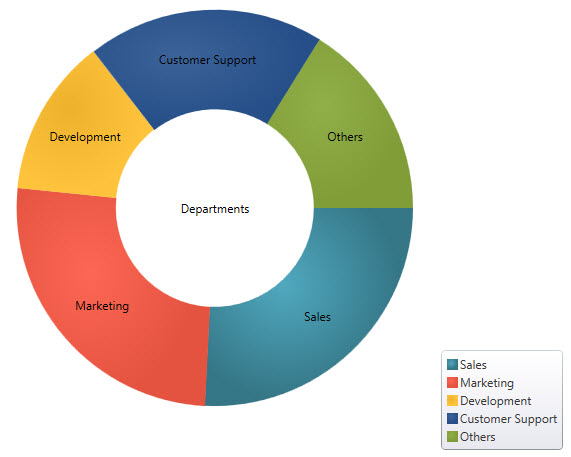
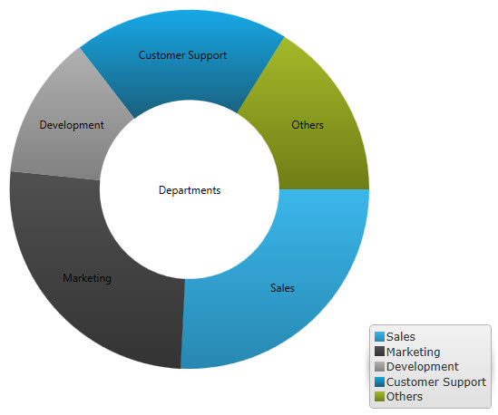

////

|metadata|
{
    "name": "xamdoughnutchart-new-default-style",
    "controlName": [],
    "tags": [],
    "guid": "e7162ac0-9012-4417-864b-c6a6fbca9562",  
    "buildFlags": ["SL","WPF","XAML"],
    "createdOn": "2014-06-05T19:45:38.0688076Z"
}
|metadata|
////

= New Default Style

== Topic Overview

=== Purpose

This topic introduces the default style for the  _{DoughnutChartName}_  control. The topic illustrates the changes to the controls’ visual areas implemented with this release, along with directions on how to revert to the previous style using the legacy style file.

=== Required background

The following topic is a prerequisite to understanding this topic:

[options="header", cols="a,a"]
|====
|Topic|Purpose

| link:xamdoughnutchart-adding.html[Adding {DoughnutChartName}]
|This topic explains using a code example how to add the _{DoughnutChartName}™_ control to a {PlatformName} application.

|====

== New Default Style

=== Overview

The new default style applies various settings aimed at giving the doughnut chart a more streamline appearance. The following screenshots compare the previous style with the new default style.

==== Previous Style:

 

==== New Default Style:

== Reverting to the Previous Style

=== Style file location

The legacy style resource file resides in the following location:

_{InstallPath}\DefaultStyles\XamDataChart\legacy.xamDataChart.xaml_

=== Applying the legacy theme

In order to revert to the previous style, add the legacy resource file to the resources of your application/page as described in link:designers-guide-using-themes.html[Using Themes].

== Related Content

=== Topics

The following topics provide additional information related to this topic.

[options="header", cols="a,a"]
|====
|Topic|Purpose

| link:xamdoughnutchart-overview.html[{DoughnutChartName} Overview]
|This topic gives an overview of the _{DoughnutChartName}™_ control and its main features.

| link:xamdoughnutchart-adding.html[Adding {DoughnutChartName}]
|This topic explains using a code example how to add the _{DoughnutChartName}™_ control to a {PlatformName} application.

|====

=== Samples

The following samples provide additional information related to this topic.

[options="header", cols="a,a"]
|====
|Topic|Purpose

|
ifdef::sl[] 

link:{SamplesURL}/doughnut-chart/#/theming[Theming] 

endif::sl[] 

ifdef::wpf[] 

link:{SamplesURL}/doughnut-chart/theming[Theming] 

endif::wpf[]
|This sample demonstrates how to use all themes available for the Doughnut Chart control.

|====