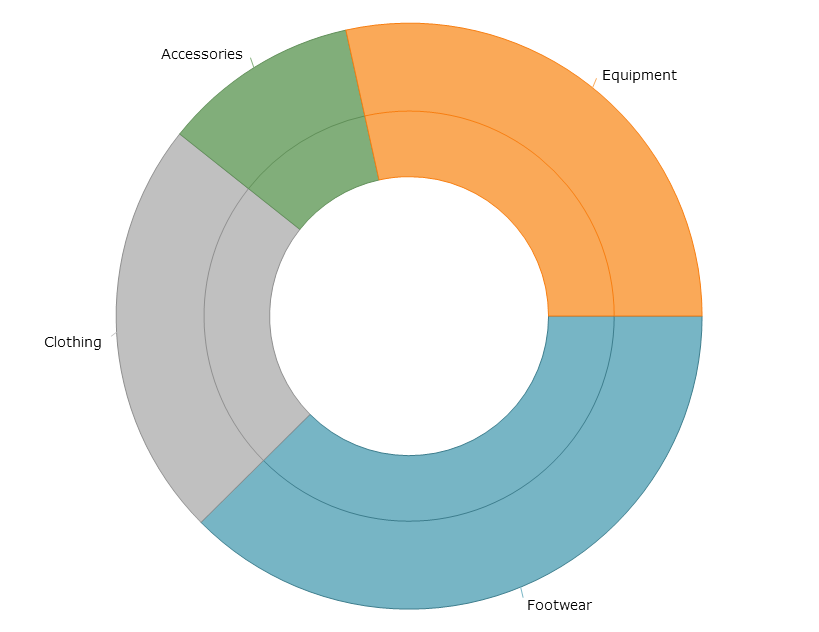

////
|metadata|
{
    "name": "xamdoughnutchart-overview",
    "controlName": ["{DoughnutChartName}"],
    "tags": ["Charting","Data Presentation","Getting Started"],
    "guid": "02b60d6a-61c3-4409-9d0b-c233e108934e",
    "buildFlags": ["SL","WPF","WINFORMS"],
    "createdOn": "2014-06-05T19:53:12.0198757Z"
}
|metadata|
////

= {DoughnutChartName} Overview

== Topic Overview

=== Purpose

This topic gives an overview of the  _{DoughnutChartName}™_   control and its main features.

=== In this topic

This topic contains the following sections:

* <<_Ref339456589,Introduction>>
* <<_Ref339456598,Main Features>>
* <<_Ref339456642,User Interactions and Usability>>
* <<_Ref339456644,Related Content>>

** <<_Ref346650725,Topics>>

ifdef::xaml[]
** <<_Ref346650742,Samples>>

endif::xaml[]

[[_Ref339456589]]
== Introduction

=== {DoughnutChartName} summary

The  _{DoughnutChartName}_   control is similar to the  pick:[xaml,android=" _xamPieChart_  "]  pick:[win-forms=" _UltraPieChart_  "]  –proportionally illustrating the occurrences of a variable. The  _{DoughnutChartName}_   can display multiple variables in concentric rings, and provides built-in support for visualizing hierarchical data.

.Note:
[NOTE]
====
Currently the support for hierarchical data is released as community technology preview (CTP).
====

The following screenshot illustrates a 2 variable  _{DoughnutChartName}_  .

[[_Ref339456598]]
== Main Features

=== Main features summary chart

The following table summarizes the  _{DoughnutChartName}_   control’s main features.

[options="header", cols="a,a"]
|====
|Feature|Description

|Multiple rings support
|The _{DoughnutChartName}_ can display multiple rings at the same time with each of the rings capable of being bound to a different collection, or they can share a common data source. 

ifdef::xaml,android[] 

image::images/XamDoughnutChart_Overview_1.png[] 

endif::xaml,android[] 

ifdef::win-forms[] 

 

endif::win-forms[]

|Slice selection
|The _{DoughnutChartName}_ exposes the API for setting the state of one or more slices to `selected`. Optionally, you may apply a single custom visual style to the selected slices. 

ifdef::xaml,android[] 

image::images/XamDoughnutChart_Overview_2.png[] 

endif::xaml,android[] 

ifdef::win-forms[] 

image::images/Doughnut.png[] 

endif::win-forms[]

|Slice explosion
|The _{DoughnutChartName}_ slices explode either programmatically or by user interaction. 

ifdef::xaml,android[] 

image::images/XamDoughnutChart_Overview_3.png[] 

endif::xaml,android[] 

ifdef::win-forms[] 

image::images/WN_Doughnut.png[] 

endif::win-forms[] 

|Hierarchical data support (Community Technology Preview)
|The _{DoughnutChartName}_ exposes a special kind of series built especially to visualize hierarchical data. 

ifdef::android,xaml[] 

image::images/XamDoughnutChart_Overview_4.png[] 

endif::android,xaml[]

|====

[[_End-User_Data_Selection]]
[[_Tree_Dimensions]]
[[_Ref339456637]]
[[_Slice_Interaction]]
[[_Defer_Update]]
[[_Interaction_with_Other]]
[[_Ref339456642]]
== User Interactions and Usability

=== User interactions summary chart

The following table summarizes the  _{DoughnutChartName}_   control’s user interaction capability.

[options="header", cols="a,a,a,a"]
|====
|The user can…|Using…|Details|Configurable?

|Click slices
|Mouse-clicks
|The _{DoughnutChartName}_ exposes a link:{DoughnutChartLink}.{DoughnutChartName}{ApiProp}sliceclick_ev.html[SliceClick] event, raised when the user clicks on a slice. Enabling slice selection or slice explosion allows you to modify the slice's selection and explosion state upon click.
|image::images/Yes.png[]

|====

[[_Ref339456644]]
== Related Content

[[_Ref346650725]]

=== Topics

The following topics provide additional information related to this topic.

[options="header", cols="a,a"]
|====
|Topic|Purpose

| link:xamdoughnutchart-adding.html[Adding {DoughnutChartName}]
|This topic explains using a code example how to add the _{DoughnutChartName}™_ control to a {PlatformName} application.

| link:xamdoughnutchart-configuring-selection-and-explosion.html[Configuring Selection and Explosion ({DoughnutChartName})]
|This topic explains how to configure selection and explosion for the slices of the _{DoughnutChartName}_ .

| link:xamdoughnutchart-api-overview.html[API Reference ({DoughnutChartName})]
|This topic provides links to the most notable members of the link:{DoughnutChartLink}.{DoughnutChartName}_members.html[{DoughnutChartName}] class.

|====
ifdef::sl,wpf[]
[[_Ref346650742]]

=== Samples

ifdef::xaml[]
The following samples provide additional information related to this topic.
endif::xaml[]

[options="header", cols="a,a"]
|====
|Sample|Purpose

|
ifdef::sl[] 
pick:[xaml=" link:{SamplesURL}/doughnut-chart/#/doughnut-chart[Doughnut Chart]"] pick:[xaml=""] 

endif::sl[] 

ifdef::wpf[] 
pick:[xaml=" link:{SamplesURL}/doughnut-chart/doughnut-chart[Doughnut Chart]"] pick:[xaml=""] 

endif::wpf[] 

|This sample demonstrates a basic configuration for _{DoughnutChartName}_ and some of its main properties.

|
ifdef::sl[] 
pick:[xaml=" link:{SamplesURL}/doughnut-chart/#/multiple-rings[Multiple Rings]"] pick:[xaml=""] 

endif::sl[] 

ifdef::wpf[] 
pick:[xaml=" link:{SamplesURL}/doughnut-chart/multiple-rings[Multiple Rings]"] pick:[xaml=""] 

endif::wpf[] 

|This sample demonstrates how to display multiple ring series in a _{DoughnutChartName}_ .

|
ifdef::sl[] 
pick:[xaml=" link:{SamplesURL}/doughnut-chart/#/selection-and-explosion[Selection and Explosion]"] pick:[xaml=""] 

endif::sl[] 

ifdef::wpf[] 
pick:[xaml=" link:{SamplesURL}/doughnut-chart/selection-and-explosion[Selection and Explosion]"] pick:[xaml=""] 

endif::wpf[] 

|This sample demonstrates how to configure selection and explosion for slices of the _{DoughnutChartName}_ .

|====
endif::sl,wpf[] 